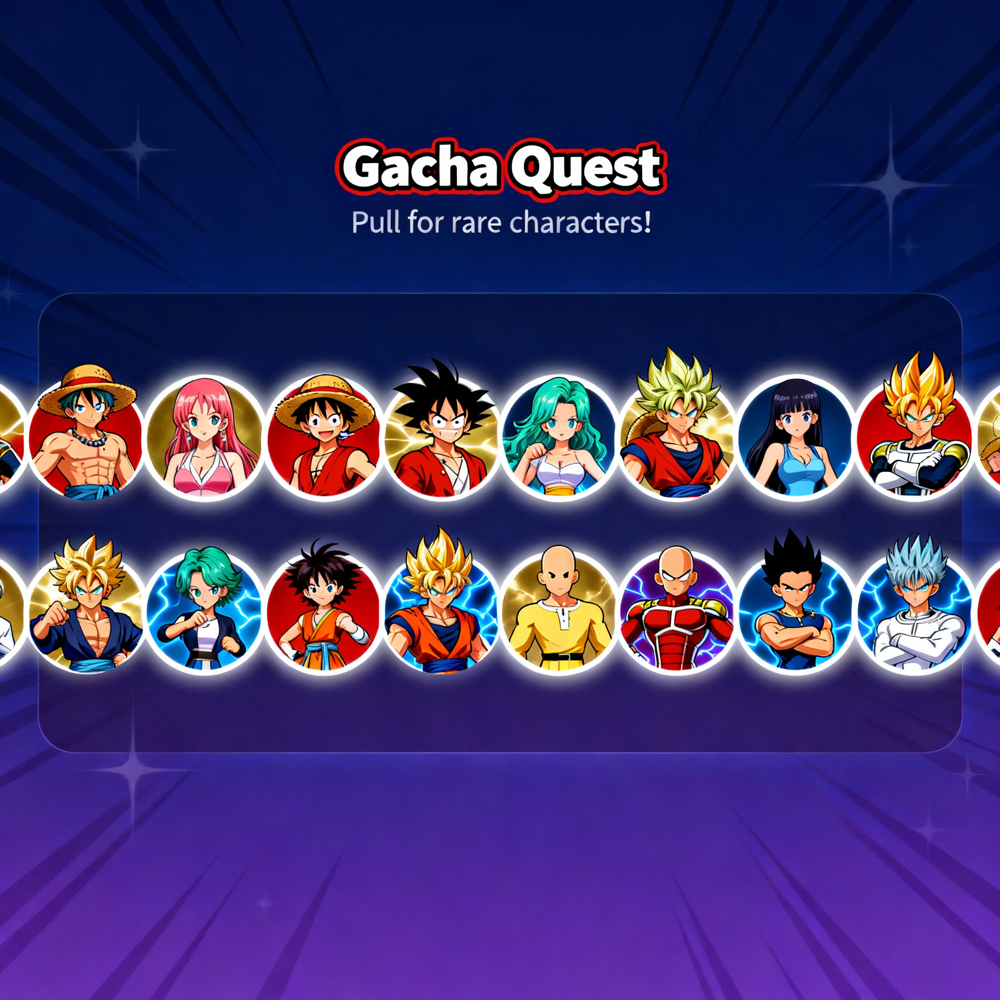

# Discord Gacha Bot
A Discord bot inspired by gacha/claim-style waifu bots. Roll characters, claim them, build your collection, and compete with friends!
This bot uses an SQLite database to track users, characters, inventories, and cooldowns. Characters are automatically fetched from AniList's API with images and metadata.
## Features
- **Roll System**: Roll random characters with `$w` / `$roll` (limited rolls per hour)
- **Claim System**: Claim your rolled characters within a time window using `$claim`
- **Currency System**: Earn cash through daily rewards and claiming characters
- **Daily Rewards**: Get free cash every ~20 hours with `$daily`
- **Inventory Tracking**: View your collection with `$inventory`
- **Owner Commands**: Populate the database with AniList characters (`$populate`) or manually add custom characters (`$addcard`)
- **Cooldown Management**: Built-in rate limiting and cooldowns for a fair gameplay experience
## Commands
| Command             | Access     | Description                                                                                   |
| ------------------- | ---------- | --------------------------------------------------------------------------------------------- |
| `$info`             | everyone   | Show game rules and how the bot works.                                                        |
| `$w` / `$roll`      | everyone   | Roll a random character. You get a limited number of rolls per hour.                          |
| `$claim`            | everyone   | Claim the last character you rolled in that channel, if you're still within the claim window. |
| `$daily`            | everyone   | Get free in-game currency once per cooldown period.                                           |
| `$balance`          | everyone   | Show your current currency.                                                                   |
| `$inventory [user]` | everyone   | Show your collection, or another user's collection.                                           |
| `$rolls`            | everyone   | Refresh your roll count after a "vote-style" reset. Has its own cooldown.                     |
| `$vote`             | everyone   | Gives a link / message telling users how to "support the bot".                                |
| `$populate <n>`     | owner only | Pull up to `n` characters from AniList and insert them into the database.                     |
| `$addcard ...`      | owner only | Manually add a specific character (name, series, rarity, image, value) into the database.     |
### Important Cooldown Rules
- **Rolls**: You only get 10 rolls per hour (automatically resets)
- **Claim Cooldown**: Global 3-hour cooldown between successful claims per user
- **Claim Window**: You must claim within 120 seconds after rolling or the character expires
